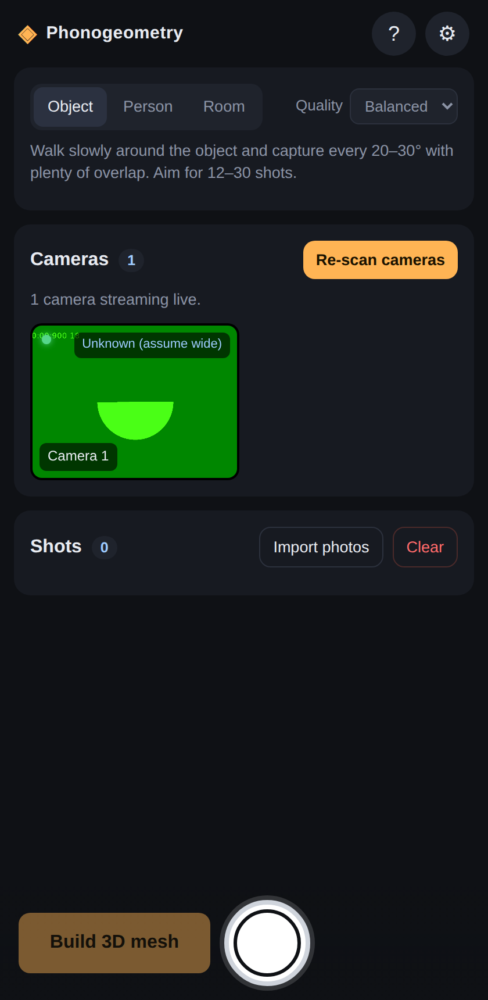
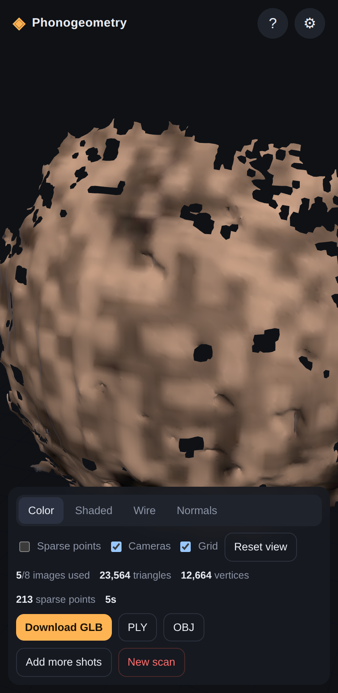

# Phonogeometry

Turn every camera on your phone into a 3D scanner.

Phonogeometry is a progressive web app that opens **all the cameras your phone exposes** (wide, ultra-wide, telephoto, front) and captures from them simultaneously. From a handful of shots taken while you move around, it reconstructs a **textured 3D mesh** of a room, a person or an object, entirely on the device, and exports it as GLB, PLY or OBJ.

No app store, no server, no account: it runs in the phone's browser and works offline once installed.

<p align="center">
  
  &nbsp;
  
</p>
<p align="center"><sub>Capture screen (with a browser test camera) and the viewer showing a reconstruction of a synthetic test scene with its eight camera frusta.</sub></p>

## How it works

Every shutter press grabs a frame from each camera at the same instant. Wide and ultra-wide lenses give context and coverage, the telephoto gives detail, and the front camera looks the opposite way, which is what you want when you scan a room. Between shots you move; the parallax between viewpoints is what makes the 3D.

The reconstruction pipeline is written from scratch in plain JavaScript and runs in a Web Worker:

| Stage | Method | Code |
| --- | --- | --- |
| Features | Multi-scale FAST corners with oriented BRIEF descriptors (ORB-style, 256 bit) | `src/vision/fast.js`, `src/vision/orb.js` |
| Matching | Brute-force Hamming with ratio test and mutual check; candidate pairs from shot order plus a global thumbnail descriptor | `src/vision/match.js` |
| Two-view geometry | Normalised eight-point essential matrix inside RANSAC, cheirality-based pose recovery | `src/vision/geometry.js` |
| Structure from motion | Incremental: feature tracks, best-pair initialisation, PnP registration (DLT + RANSAC + Levenberg–Marquardt), pairwise pose chaining fallback | `src/vision/sfm.js` |
| Bundle adjustment | Sparse Levenberg–Marquardt with the Schur complement and Huber loss; refines one focal length per physical camera | `src/vision/ba.js` |
| Dense depth | Multi-view plane sweep with zero-mean normalised cross-correlation (robust to exposure differences between physical cameras), sub-plane refinement, cross-view consistency check; runs on the GPU through WebGL2 with an identical CPU fallback | `src/vision/planeSweepGPU.js`, `src/vision/planeSweep.js` |
| Fusion | Truncated signed distance volume with per-voxel colour; object and person scans focus the volume on the point the cameras converge on | `src/mesh/tsdf.js`, `src/pipeline/reconstruct.js` |
| Meshing | Naive surface nets, component filtering, Taubin smoothing, vertex colours | `src/mesh/surfaceNets.js`, `src/mesh/meshUtils.js` |
| Export | GLB (glTF 2.0 binary), binary PLY, OBJ | `src/mesh/exporters.js` |

The viewer uses three.js (vendored in `vendor/three`, MIT licensed).

## Running it

Phones only allow camera access from a secure origin, so you need HTTPS (or `localhost`).

```bash
npm run start:https
```

There are no dependencies to install and no build step.

The server prints a `https://<your LAN IP>:8443/` URL. Open it on the phone (same Wi-Fi), accept the self-signed certificate once, and tap **Enable all cameras**. Alternatively, deploy the folder to any static host with HTTPS (GitHub Pages, Netlify, Cloudflare Pages…).

On a desktop browser you can use **Import photos** instead of the cameras.

Shots are kept in the browser's IndexedDB, so if the tab reloads mid-scan (phones do this under memory pressure) they are restored when you come back.

### Scanning tips

- **Object**: circle it, one shot every 20–30°, 12–30 shots. Matte, textured objects work best.
- **Person**: they stand still; you circle them at chest height, then add a higher and a lower pass.
- **Room**: stand near the centre, shoot, step a metre sideways, shoot again; go round twice at two heights. Front and back cameras fire together, so each shot covers two walls.
- Overlap each shot at least 50% with the previous one. Plain walls and glossy surfaces reconstruct poorly.
- Vary your distance to the subject in a few shots (step in, step back). That is what lets the app calibrate each lens's focal length, which browsers do not report.
- **Fast** quality takes well under a minute for a dozen shots on a recent phone; **High** can take several minutes.

### Camera lenses

Browsers do not report focal lengths. Each camera is mapped to a lens type (wide, ultra-wide, telephoto, front) from its label, which sets its initial field of view; bundle adjustment then refines one focal length per physical camera, which corrects errors of 10–20% when the shots vary in distance. If a phone reports generic names ("camera2 0, facing back") check the mapping under **Settings**: a closer starting guess still helps. Imported photos use the 35 mm-equivalent focal length from EXIF when present.

Some phones refuse to stream several rear cameras at the same time. Cameras that cannot be opened concurrently are captured sequentially right after the simultaneous ones (this is on by default and can be disabled in Settings); hold still for that half second.

## Limits

- The scale of the model is arbitrary. A single phone cannot measure absolute size from images alone; export and scale in your 3D tool if you need real units.
- Moving subjects, mirrors, glass, and textureless surfaces break photogrammetry, here as everywhere.
- Feature matching, structure from motion and fusion run on the CPU in JavaScript; the dense depth stage runs on the GPU when the browser offers WebGL2 with float render targets (most phones since 2018). Resolutions and voxel counts are modest by design.

## Development

```bash
npm test          # unit and end-to-end tests on synthetic scenes (Node >= 18)
npm start         # plain HTTP on :8080 for desktop development (imports only)
npm run icons     # regenerate the PWA icons
```

The tests render synthetic textured scenes with ground truth and check each stage (essential matrix and PnP recovery, bundle adjustment convergence and focal-length recovery, SfM pose accuracy, plane-sweep depth accuracy, TSDF/surface-nets geometry, exporter validity) as well as full reconstructions.

The GPU plane sweep cannot run under Node. Start the dev server and open `test/browser/index.html` in a browser: it compares the GPU and CPU depth maps of a synthetic scene against the ground truth and prints coverage, accuracy, agreement and timings.

## Project layout

```
index.html, styles.css, src/app.js   UI and application flow
src/camera/                          camera discovery, simultaneous capture, intrinsics, EXIF
src/pipeline/                        worker entry and the reconstruction orchestrator
src/vision/                          linear algebra, features, matching, geometry, SfM, BA, plane sweep
src/mesh/                            TSDF, surface nets, mesh utilities, exporters
src/viewer/                          three.js viewer
test/                                node:test suites and synthetic scene renderers
server.js                            dev server (HTTP/HTTPS with self-signed certificate)
sw.js, manifest.webmanifest, icons/  PWA
```

## License

MIT. three.js is © its authors, MIT licensed (see `vendor/three/LICENSE`).
