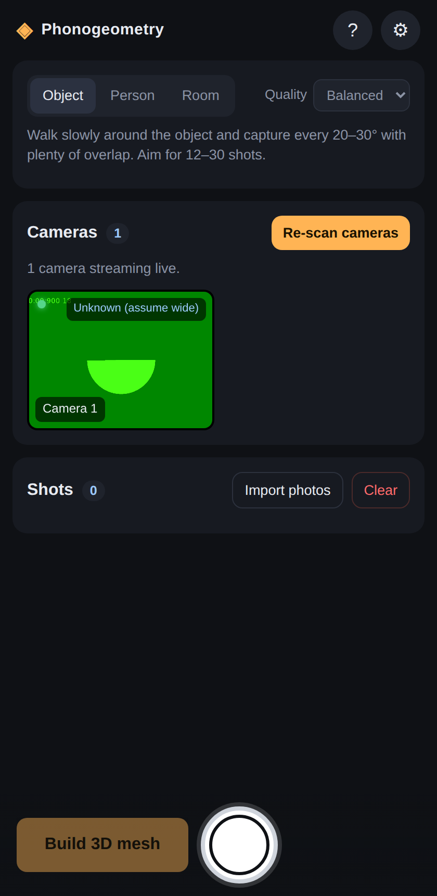
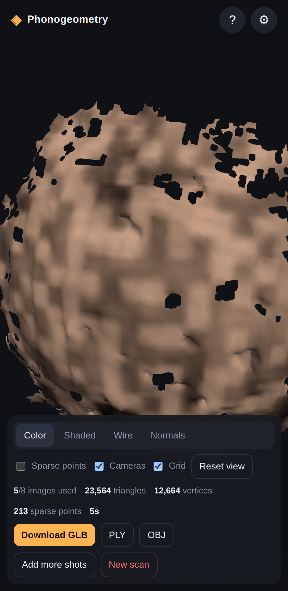

# Phonogeometry

Turn every camera on your phone into a 3D scanner.

Phonogeometry is a progressive web app that opens **all the cameras your phone exposes** (wide, ultra-wide, telephoto, front) and captures from them simultaneously. From a handful of shots taken while you move around, it reconstructs a **textured 3D mesh** of a room, a person or an object, entirely on the device, and exports it as GLB, PLY or OBJ.

No app store, no server, no account: it runs in the phone's browser and works offline once
loaded. That is tested, not assumed: with the network cut after the first visit, the app
still opens, imports photos, reconstructs and exports.

<p align="center">
  
  &nbsp;
  
</p>
<p align="center"><sub>Capture screen (with a browser test camera) and the viewer showing a reconstruction of a synthetic test scene with its eight camera frusta.</sub></p>

## How it works

Every shutter press grabs a frame from each camera at the same instant. Wide and ultra-wide lenses give context and coverage, the telephoto gives detail, and the front camera looks the opposite way, which is what you want when you scan a room. Between shots you move; the parallax between viewpoints is what makes the 3D.

The reconstruction pipeline is written from scratch in plain JavaScript and runs in a Web Worker:

| Stage | Method | Code |
| --- | --- | --- |
| Features | Multi-scale FAST corners with oriented BRIEF descriptors (ORB-style, 256 bit) | `src/vision/fast.js`, `src/vision/orb.js` |
| Matching | Brute-force Hamming with ratio test and mutual check; candidate pairs from shot order plus a global thumbnail descriptor | `src/vision/match.js` |
| Two-view geometry | Normalised eight-point essential matrix inside RANSAC, cheirality-based pose recovery; radial distortion model for keypoints and images | `src/vision/geometry.js` |
| Structure from motion | Incremental: feature tracks, best-pair initialisation, PnP registration (DLT + RANSAC + Levenberg–Marquardt), pairwise pose chaining fallback | `src/vision/sfm.js` |
| Camera rig | Calibrates the fixed transform between the phone's cameras from the shots where both are placed, then uses it to register frames structure from motion cannot, and to merge a camera that shares no features at all (the front one) by aligning the two camera paths | `src/vision/sfm.js` |
| Bundle adjustment | Sparse Levenberg–Marquardt with the Schur complement and Huber loss; refines one focal length per physical camera | `src/vision/ba.js` |
| Dense depth | Multi-view plane sweep with zero-mean normalised cross-correlation (robust to exposure differences between physical cameras), sub-plane refinement, cross-view consistency check; runs on the GPU through WebGL2 with an identical CPU fallback | `src/vision/planeSweepGPU.js`, `src/vision/planeSweep.js` |
| Fusion | Truncated signed distance volume with per-voxel colour; object and person scans focus the volume on the point the cameras converge on | `src/mesh/tsdf.js`, `src/pipeline/reconstruct.js` |
| Meshing | Naive surface nets, component filtering, Taubin smoothing, vertex colours | `src/mesh/surfaceNets.js`, `src/mesh/meshUtils.js` |
| Export | GLB (glTF 2.0 binary), binary PLY, OBJ, dense point cloud PLY, in metres once a scale is set | `src/mesh/exporters.js` |

The viewer uses three.js (r160, vendored in `vendor/three`, MIT licensed; version, upstream paths and checksums are recorded in [docs/vendored-three.md](docs/vendored-three.md)).

## The camera rig

The cameras fired in one shot are bolted to the same phone, so the transform between them is
the same in every shot. Phonogeometry estimates that transform and puts it to work twice.

**Filling gaps.** A frame that cannot be placed on its own, because it is blurred or aimed at
a blank wall, is placed from its shot-mate's pose and then checked against whatever points it
does see.

**Joining the front camera.** The front camera looks the other way, so it shares no features
at all with the back cameras: no amount of feature matching can connect them. Phonogeometry
reconstructs the front camera's frames as their own model, then brings that model into the
main one by aligning the two camera paths, which are the same path walked by the same phone.
The result is checked twice before it is accepted: the implied rig rotation must come out the
same at every shot, and the two paths must agree to within a few percent of the size of the
scene. If either check fails the component is left out rather than merged wrongly.

That is what lets a single sweep of a room capture the wall in front of you and the wall
behind you at the same time. The few millimetres between the lenses are treated as zero,
which is far below the voxel size of any scan, so the cameras of one shot end up at the same
point.

## Watching a scan come together

Working out where each photo was taken is the slow and uncertain part of the job; turning
those positions into a surface takes a predictable amount of time. So as soon as the camera
positions are solved, the app shows them: the camera path and the sparse points appear in the
viewer with a bar reporting what is still being computed, and the finished surface replaces
them when it is ready. If the path looks wrong, stop there rather than waiting out the rest.

## When a scan comes out wrong

After processing, any photo that could not be placed in the model is greyed out and labelled
in the shot list, and the Details panel on the processing screen names them. The usual causes,
in order of how often they bite:

- **Too little overlap** between consecutive shots. Move less between shots.
- **A blurred frame**, flagged with a badge as soon as it is captured. Retake it.
- **A blank or glossy surface** with no texture to match.
- **Something moved** between shots.

## Limits

- A phone cannot measure absolute size from photographs alone, so a scan comes out at an
  arbitrary scale. Tell it the size of one thing and the rest follows: tap **Set scale**, tap
  two points on the model that span something you know, and type the real distance. The
  model's dimensions then appear on screen and every download is written in metres, which is
  what glTF expects, so a GLB opens at its true size in other tools.
- Moving subjects, mirrors, glass, and textureless surfaces break photogrammetry, here as everywhere.
- A camera aimed at one flat wall and nothing else is a degenerate case, not merely a hard one: every distance explains the photographs equally well. Phonogeometry places the cameras correctly and returns a flat surface at the wrong distance rather than refusing. Keep something with depth in view.
- Feature matching, structure from motion and fusion run on the CPU in JavaScript; the dense depth stage runs on the GPU when the browser offers WebGL2 with float render targets (most phones since 2018). Resolutions and voxel counts are modest by design.
- A long scan spends most of its time comparing every image against its neighbours, and that
  work grows with the number of image pairs. Forty photos at Balanced take a few minutes on a
  phone. Fast quality is roughly two and a half times quicker and is the right choice while
  you are still finding out whether a scan works.
- Long scans are bounded by memory rather than patience. Forty frames at Balanced quality peak at about 250 MB in the worker, which fits comfortably on a modern phone; High quality costs roughly twice that, so keep High for scans of thirty frames or fewer unless the phone is a recent flagship.

## Running it

Phones only allow camera access from a secure origin, so you need HTTPS (or `localhost`).

```bash
npm run start:https
```

There are no dependencies to install and no build step.

The server prints a `https://<your LAN IP>:8443/` URL. Open it on the phone (same Wi-Fi), accept the self-signed certificate once, and tap **Enable all cameras**. Alternatively, publish it as a website on any static host with HTTPS (GitHub Pages, Netlify, Cloudflare Pages, Apache, nginx): see [Deploy](#deploy).

`npm run start:https` is the LAN mode, so it listens on every interface. Plain `npm start` listens on `localhost` only; add `--host=0.0.0.0` if you want to reach it from another device over HTTP. In the LAN modes the server answers to this machine's own names — its addresses, its hostname, and mDNS names such as `laptop.local` — and reads its interfaces again on a miss, so a Wi-Fi joined after the start still works. Reaching it any other way — a port forwarded by Docker, WSL2, a VM or a tunnel, or a name your router hands out — needs that address in `ALLOWED_HOST` (a comma-separated list; ports are ignored). Any other `Host` gets a 403 and one line on the terminal saying so, which is what keeps a page you visit from reaching the checkout by pointing its own name at 127.0.0.1.

On a desktop browser you can use **Import photos** instead of the cameras.

Shots are kept in the browser's IndexedDB, so if the tab reloads mid-scan (phones do this under memory pressure) they are restored when you come back. They are photographs, and they are on the device: they outlive the tab and the browser, and the app asks the browser not to evict them, so they are still there when the app is next opened — by whoever is holding the phone. **Clear** deletes them, and so does **New scan**; a scan older than a day is deleted the next time the app opens.

### Scanning tips

- Four photographs is about the fewest that can produce any surface at all, and a good scan
  needs many more. Fewer than that, and the app will not offer to build.
- **Object**: circle it in small steps, roughly 10° apart, 20–40 shots. Matte, textured objects work best.
- **Person**: they stand still; you circle them at chest height in small steps, then add a higher and a lower pass.
- **Room**: stand near the centre, shoot, step half a metre sideways, shoot again; go round twice at two heights. Front and back cameras fire together, so each shot covers two walls.
- **Overlap generously.** Each shot should share well over half its view with the previous one. This is the single thing that decides whether a scan works. Measured on a synthetic object, consecutive views about 8° apart reconstruct completely, 12° apart partially, and beyond about 16° the matching gives out and the scan breaks into pieces. Fewer, wider-spaced shots are a false economy: the work grows with the number of image pairs, and a broken scan costs everything.
- Keep something with depth in view, such as furniture or a corner. A flat wall filling the frame is ambiguous: no method can recover its distance from photographs alone.
- Keep the phone steady. Phonogeometry measures the sharpness of every frame and marks any that are much softer than the others from the same camera, because one blurred shot in the middle of a sequence can fail to match its neighbours and strand everything after it: in testing a single frame blurred by three pixels halved the number of images that could be placed. Retake the ones it flags.
- Vary your distance to the subject in a few shots (step in, step back). That is what lets the app calibrate each lens's focal length, which browsers do not report.
- **Fast** quality takes well under a minute for a dozen shots on a recent phone; **High** can take several minutes.

### Camera lenses

Browsers do not report focal lengths. Each camera is mapped to a lens type (wide, ultra-wide, telephoto, front) from its label, which sets its initial field of view; bundle adjustment then refines one focal length and one radial distortion coefficient per physical camera. This corrects focal errors of 10–20% and the barrel distortion of ultra-wide lenses when the shots vary in distance. The calibrated values are printed under Details on the processing screen. If a phone reports generic names ("camera2 0, facing back") check the mapping under **Settings**: a closer starting guess still helps. Imported photos use the 35 mm-equivalent focal length from EXIF when present.

Some phones refuse to stream several rear cameras at the same time. Cameras that cannot be opened concurrently are captured sequentially right after the simultaneous ones (this is on by default and can be disabled in Settings); hold still for that half second.

### Deploy

The app is also a website, and the website is the files the page loads and nothing else: the
page and its not-found page, the stylesheet, every module under `src/`, the vendored three.js
and its licence, the service worker, the manifest and icons, `robots.txt` and
`.well-known/security.txt`. `node tools/site.js <folder>` copies them into an empty folder and
`node tools/site.js --list` names them; the list is the service worker's shell plus those few
files, so nothing else in the repository (notes, tests, tools, the dev server, the hosting
settings) is ever published. Nothing is built: the copy is the committed files as they are.
Everything still happens in the visitor's browser. The host only serves files, and the
photographs, shots and meshes never leave the device.

`.github/workflows/pages.yml` publishes that list to GitHub Pages: a push to `main` runs `npm test` and uploads those files as committed. Three things outside the files have to be in place first. Pages has to be set to deploy from Actions (Settings → Pages → Source: GitHub Actions). A `main` branch has to exist, and this repository does not have one yet. And the `github-pages` environment has to accept deployments from `main`: by default it admits the default branch, so the simplest arrangement is to make `main` the default (otherwise add it to the environment's deployment branches). Running the workflow by hand (Actions → Run workflow) is offered only once `pages.yml` is on the default branch.

The app runs from the project's sub-path (`<user>.github.io/<repository>/`), installs, and works offline there. Online the service worker asks the network first, so a visit gets what the host is serving. An installed copy takes a deploy offline as a whole: the service worker's cache name (`VERSION` in `sw.js`) is a hash of the files it caches, so a deploy that changes any of them is a new worker, which downloads them all again and drops the old copy; `npm test` fails, printing the value to use, until `VERSION` matches the files.

Any static host with HTTPS will serve the folder. The repository carries the settings of the
common ones, with the same headers in each:

| Host | Copy the site with | Settings it reads |
| --- | --- | --- |
| Netlify | `node tools/site.js <folder> --host=netlify` | `_headers`, `_redirects` |
| Cloudflare Pages | `node tools/site.js <folder> --host=cloudflare` | `_headers` |
| Apache | `node tools/site.js <folder> --host=apache` | `.htaccess` |
| nginx | `node tools/site.js <folder>` | `deploy/nginx.conf`, copied into the server's configuration by hand |
| GitHub Pages | the workflow | none: see below |

Serve it over HTTPS only: phones open their cameras only for a secure page, and the Apache and
nginx settings redirect plain `http://` (Netlify, Cloudflare Pages and GitHub Pages each have a
switch for it). Never point a web server at a git checkout: `.git/` holds the whole history, and
`.certs/` the dev server's private key once `npm run start:https` has run. If it happens anyway,
the Apache and nginx settings serve the site's own files and answer 404 for everything else, and
`_redirects` does the same for the repository's files on Netlify; Cloudflare Pages has no 404
rule, so there the folder is the only protection.

**Response headers.** The same set is in `_headers`, `.htaccess` and `deploy/nginx.conf`, and
`test/website.test.js` fails when one of them says something the others do not. Every source in
the policy was measured in Chromium with the policy sent as a response header, at a sub-path,
starting from `default-src 'none'`; the browser suite drives the whole app under it.

| Header | Value | Why |
| --- | --- | --- |
| `Content-Security-Policy` | `default-src 'none'; script-src 'self' 'sha256-…'; style-src 'self' 'sha256-…'; img-src 'self' data:; worker-src 'self'; connect-src 'self'; manifest-src 'self'; base-uri 'none'; form-action 'none'; object-src 'none'; require-trusted-types-for 'script'; trusted-types phonogeometry; frame-ancestors 'none'; upgrade-insecure-requests` | Only the site's own scripts run, and nothing inline or evaluated but the import map that names three.js, allowed by its hash; the style hash is the not-found page's inline style. `img-src data:` is the shot thumbnails, which are JPEG `data:` URLs kept with each shot. `connect-src 'self'` is the service worker fetching the site's own files: with `'none'` it registers and caches nothing, silently. The app itself makes no network request. Trusted Types make an HTML string sink a TypeError, so a camera label or a file name can only ever be text; the one named policy (`src/trust.js`) vouches for exactly two scripts, the reconstruction worker and `sw.js`. |
| `X-Content-Type-Options` | `nosniff` | A file is what its type says. |
| `X-Frame-Options` | `DENY` | With `frame-ancestors 'none'`: no other site can frame the app and steer its buttons (clickjacking). |
| `Referrer-Policy` | `no-referrer` | The one link out, to the source, tells GitHub nothing about where the app is hosted. |
| `Permissions-Policy` | thirty powerful features named, all off (microphone, location, motion sensors, USB, serial, MIDI, payment, display capture, fullscreen, autoplay and the rest) but `camera` and `screen-wake-lock`, which are this site's alone | The cameras, and the screen kept on through a build. With `camera=()` the browser refuses the cameras outright, and with `screen-wake-lock=()` the lock a build takes. The previews are muted, which plays with `autoplay` off as well. |
| `Cross-Origin-Opener-Policy` | `same-origin` | Another window keeps no handle on this one. |
| `Cross-Origin-Resource-Policy` | `same-origin` | Other sites cannot embed the app's files. |
| `Strict-Transport-Security` | `max-age=31536000; includeSubDomains` | Browsers remember to use HTTPS. |
| `Cache-Control` | `no-cache` | No file name carries a version, so every load revalidates (an unchanged file costs a 304) and a deploy never mixes old scripts with new HTML. The service worker keeps the offline copy. |

**GitHub Pages sends no headers.** The page carries the same policy in a `<meta>` tag, and the
referrer policy in another, so the scripts, styles, images and Trusted Types rules hold for the
page there too. What a `<meta>` cannot do needs a host that sends headers (Netlify, Cloudflare
Pages, Apache, nginx): `frame-ancestors`, so on Pages another site can frame the app; nosniff,
the permissions, the cross-origin and HTTPS headers; and the workers' own policy, since a
worker takes its policy from the response that delivered its script, not from the page, so on
Pages the reconstruction worker and the service worker run without one. `upgrade-insecure-requests`
is left out of the `<meta>` on purpose, so that `npm start -- --host=0.0.0.0` still serves another
device over plain `http://`; Pages forces HTTPS by itself.

**One origin per app.** A Pages project site lives under `platteration.github.io`, an origin it
shares with every other app the account publishes, and storage, caches and service workers
belong to the origin: a script injected into any one of those apps could read the shots this one
keeps in IndexedDB. The app keeps its database, keys and caches named after itself and treats
what it reads back as untrusted, but that limits the damage rather than preventing it. Give it
an origin of its own: a custom domain or subdomain (Settings → Pages → Custom domain), or any
host above on a domain of its own. Pages then redirects the old address, and an installed copy
follows the redirect to the new one rather than opening its cached copy of the old build; shots
taken at the old address stay in that origin's storage, which the new one cannot read.
`robots.txt` and `.well-known/security.txt` are only read at a domain's root, so they do their
job there and nothing under a Pages project path.

**Not-found page.** Every host above answers an address the site does not have with `404.html`,
which carries its own look (an inline style the policy allows by its hash) and loads nothing by
a relative path but the icon, so it renders at any address. Its one link, back to the app, is
`./`: right for any address one level below the site's root, which is what a mistyped page name
is. The Apache setting names it from the document root (`ErrorDocument 404 /404.html`); for a
site in a sub-folder, put the folder in front.

**If the page cannot start.** `src/guard.js` loads first and depends on nothing. With JavaScript
off, with a file that did not load, or with a module that threw before the app started, the
visitor reads a short note saying so where the controls would have been, rather than a page of
buttons that do nothing.

**Security contact.** `.well-known/security.txt` points to this repository's private
vulnerability report form and to `SECURITY.md`. Its `Expires` date (8 October 2027) is renewed
every year; `npm test` fails once it has passed.

**Launch checklist**, with `SITE` the https address:

```sh
curl -sI http://SITE/ | head -1                         # a 301 to https
curl -sI https://SITE/ | grep -i -E 'content-security|strict-transport|nosniff|frame-options|referrer|permissions|cross-origin|cache-control'
curl -sI https://SITE/.git/HEAD | head -1                # 404
curl -sI https://SITE/README.md | head -1                # 404
curl -s  https://SITE/src/ | grep -c 'Page not found'    # 1: the not-found page, not a file list
curl -sI https://SITE/.well-known/security.txt | head -1 # 200
```

Then open the site on a phone, enable the cameras, take a few shots, build a mesh and download
it, and check that the browser console shows no `Content Security Policy`, `Permissions policy`
or `Trusted Type` lines.

## Development

```bash
npm test                  # unit tests and whole reconstructions on synthetic scenes (Node >= 22)
npm run test:conventions  # the repository's shape against CONVENTIONS.md
npm run check             # the gate before a push: both of the above
npm run test:e2e          # the whole app in a real browser (needs Playwright; skips if absent)
npm run test:all          # npm test, then the browser suite
npm start                 # plain HTTP on localhost:8080 for desktop development (imports only)
npm run icons             # regenerate the PWA icons
```

The tests render synthetic textured scenes with ground truth and check each stage (essential matrix and PnP recovery, bundle adjustment convergence and focal-length recovery, SfM pose accuracy, plane-sweep depth accuracy, TSDF/surface-nets geometry, exporter validity) as well as full reconstructions.

`npm run test:e2e` drives the real application in Chromium: it captures from the
browser's fake camera, imports rendered photographs, checks that a blurred one is flagged and
sharp ones are not, reconstructs a scan and confirms every photo was used, times the camera
preview against the finished mesh, downloads all three exports, reloads to confirm shots
survive, feeds it a scan that cannot work and checks the reason reaches whichever screen the
user is on, all under the policy the page carries in its `<meta>`. Then it copies the website
with `tools/site.js` and serves it from a sub-path, as GitHub Pages does, sending every response
the headers `_headers` writes, and drives the app there under the header policy (camera, shots,
import, a build, the viewer, all four exports, the service worker's install, the manifest),
failing on any policy violation, console error, page error or request that leaves the site. It
checks that Trusted Types are enforced, that a missing address gets the site's 404 page, that
the repository's own files are not published, that another site cannot frame the app, and that
the safety net speaks with JavaScript off, a module missing and a module that throws; then it
checks that a file changed on the host reaches the offline copy, shuts that server down and runs
a whole scan offline. It skips itself with
a message if Playwright is not installed; set `REQUIRE_BROWSER=1` to make that a failure
instead, which is what continuous integration does so the suite cannot pass by skipping.
CI runs `npm test`, `npm run test:conventions` and the browser suite, and a separate job
compares the vendored three.js with the package on the npm registry
(`npm run verify:vendor`), which needs the network.

The GPU plane sweep needs a browser too. Start the dev server and open
`test/browser/index.html`: it compares the GPU and CPU depth maps of a synthetic scene against
the ground truth and prints coverage, accuracy, agreement and timings.

## Project layout

```
index.html, styles.css, src/app.js   UI and application flow
src/camera/                          camera discovery, simultaneous capture, intrinsics, EXIF
src/pipeline/                        worker entry and the reconstruction orchestrator
src/vision/                          linear algebra, features, matching, geometry, SfM, BA, plane sweep
src/mesh/                            TSDF, surface nets, mesh utilities, exporters
src/viewer/                          three.js viewer
src/guard.js                         the safety net, loaded first: a note in place of the controls when the page cannot start
src/trust.js                         the Trusted Types policy for the two scripts the app starts
test/                                node:test suites and synthetic scene renderers
server.js                            dev server (HTTP/HTTPS with self-signed certificate)
sw.js, manifest.webmanifest, icons/  PWA
tools/site.js                        the website: the files it publishes, copied into a folder for a host
404.html, robots.txt, .well-known/   the rest of the website
_headers, _redirects, .htaccess,     Netlify and Cloudflare Pages, Netlify, Apache and nginx settings:
deploy/nginx.conf                    one set of headers
```

## License

MIT. three.js is © its authors, MIT licensed (see `vendor/three/LICENSE`).
